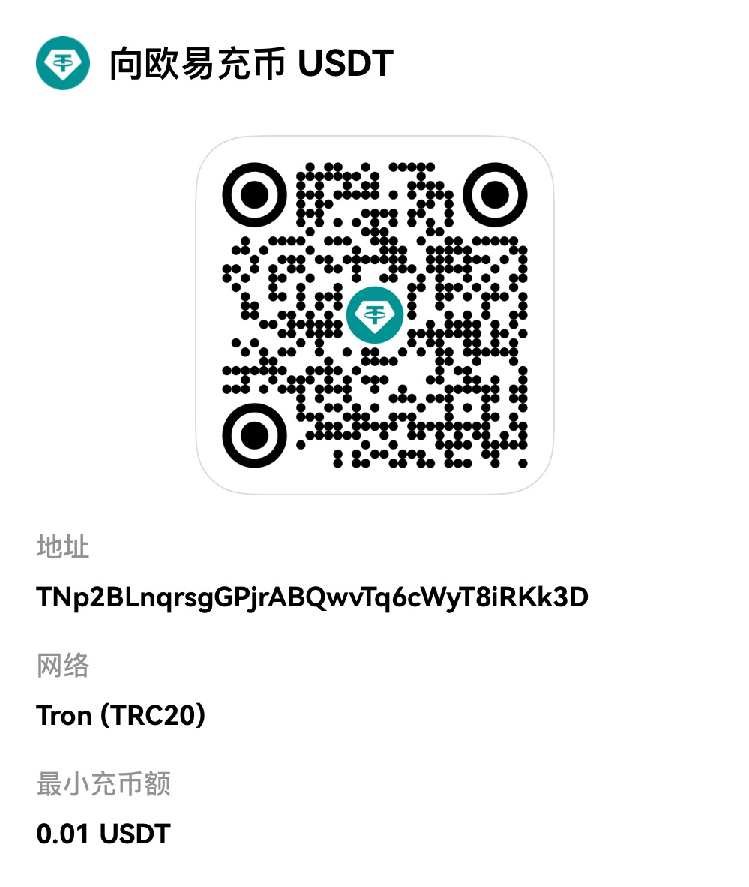

# MeshCentral 浼佷笟绾т竴閿儴缃茶剼鏈珼ocker

## 馃搵 鑴氭湰浠嬬粛

杩欐槸涓€涓笓涓?Debian/ubuntu 璁捐鐨?MeshCentral 浼佷笟绾т竴閿瓺ocker閮ㄧ讲鑴氭湰锛屾彁渚涘畬鏁寸殑杩滅▼鎺у埗鏈嶅姟鍣ㄨВ鍐虫柟妗堛€?
### 鉁?涓昏鍔熻兘

- **馃殌 涓€閿儴缃?* - 鑷姩瀹屾垚鎵€鏈夊畨瑁呮楠?- **馃攲 绔彛鑷畾涔?* - 鏀寔鑷畾涔夌鍙ｆ槧灏勶紝瑙ｅ喅绔彛鍐茬獊
- **馃洝锔?闃茬伀澧欓厤缃?* - 鑷姩閰嶇疆 UFW 闃茬伀澧欒鍒?- **鈿?鎬ц兘浼樺寲** - 鍚敤 WebRTC銆侀珮娓呯敾璐ㄧ瓑浼樺寲閫夐」
- **馃攼 璇佷功绠＄悊** - 鏅鸿兘璇佷功鐢熸垚鍜岀鐞?- **馃寪 鍩熷悕閰嶇疆** - 鏀寔 IP 鍜屽煙鍚嶈闂厤缃?- **馃攧 鏈嶅姟绠＄悊** - 瀹屾暣鐨勫惎鍔?鍋滄/閲嶅惎鍔熻兘

### 馃幆 閫傜敤鍦烘櫙

- 浼佷笟杩滅▼妗岄潰绠＄悊
- IT 杩愮淮鍥㈤槦杩滅▼鏀寔
- 鏁欒偛鏈烘瀯杩滅▼鏁欏
- 涓汉杩滅▼璁惧绠＄悊

## 馃搵 绯荤粺瑕佹眰

- **鎿嶄綔绯荤粺**: Debian 12 LTS
- **纭欢瑕佹眰**: 鏈€浣?2GB RAM锛屾帹鑽?4GB+
- **缃戠粶瑕佹眰**: 鍏綉 IP 鎴栧唴缃戝彲璁块棶
- **鏉冮檺瑕佹眰**: root 鎴?sudo 鏉冮檺

## 馃殌 蹇€熷紑濮?
### 1. 涓嬭浇鑴氭湰

```bash
wget https://raw.githubusercontent.com/xx2468171796/easymeshcentral/main/easymeshcentral.sh
chmod +x easymeshcentral.sh
./easymeshcentral.sh
```
### 2. 杩愯瀹夎

```bash
./install_meshcentral.sh
```

### 3. 閰嶇疆璁块棶鍦板潃

- 杈撳叆鏈嶅姟鍣?IP 鎴栧煙鍚嶏紙濡傦細192.168.1.100 鎴?mesh.example.com锛?- 閫夋嫨鏄惁浣跨敤榛樿绔彛
- 绛夊緟瀹夎瀹屾垚

### 4. 璁块棶绠＄悊鐣岄潰

鎵撳紑娴忚鍣ㄨ闂細`https://your-ip-or-domain`

## 馃摑 鍔熻兘璇﹁В

### 绔彛閰嶇疆

鑴氭湰鏀寔鑷畾涔夌鍙ｆ槧灏勶紝閬垮厤绔彛鍐茬獊锛?
- **HTTP 绔彛**: Web 鐣岄潰璁块棶锛堥粯璁?80锛?- **HTTPS 绔彛**: Web 鐣岄潰瀹夊叏璁块棶锛堥粯璁?443锛?- **Agent 绔彛**: 瀹㈡埛绔繛鎺ョ鍙ｏ紙榛樿 4433锛?- **WebRTC 绔彛**: P2P 杩炴帴绔彛锛堥粯璁?8443锛?
### 闃茬伀澧欓厤缃?
鑷姩閰嶇疆 UFW 闃茬伀澧欒鍒欙細
```bash
# 寮€鏀惧繀瑕佺鍙?ufw allow 80/tcp    # HTTP
ufw allow 443/tcp   # HTTPS
ufw allow 4433/tcp  # Agent
ufw allow 8443/tcp  # WebRTC
```

### 鎬ц兘浼樺寲

鍚敤浠ヤ笅浼樺寲閫夐」锛?- 鉁?WebRTC 鏀寔锛圥2P 杩炴帴锛?- 鉁?楂樻竻鐢昏川锛?00% 璐ㄩ噺锛?- 鉁?鏂囦欢浼犺緭鏀寔
- 鉁?缁堢璁块棶鏀寔
- 鉁?妗岄潰杩滅▼鎺у埗

## 馃敡 绠＄悊鍔熻兘

瀹夎瀹屾垚鍚庯紝鑴氭湰鎻愪緵瀹屾暣鐨勭鐞嗚彍鍗曪細

```
==============================================
       MeshCentral 绠＄悊鑿滃崟
==============================================
1. 鏌ョ湅璇︾粏閰嶇疆
2. 璋冩暣鎬ц兘璁剧疆
3. 淇敼绔彛閰嶇疆
4. 閲嶆柊閮ㄧ讲鏈嶅姟
5. 鍚姩/鍋滄鏈嶅姟
6. 鏌ョ湅鏃ュ織
7. 鏇存柊闀滃儚
8. 淇敼璁块棶鍦板潃
9. 鍗歌浇 MeshCentral
0. 閫€鍑?```

## 馃搧 鐩綍缁撴瀯

```
/opt/meshcentral/
鈹溾攢鈹€ docker-compose.yml          # Docker 缂栨帓鏂囦欢
鈹溾攢鈹€ .ports_config              # 绔彛閰嶇疆鏂囦欢
鈹溾攢鈹€ meshcentral-data/          # 鏁版嵁鐩綍
鈹?  鈹溾攢鈹€ config.json           # 涓婚厤缃枃浠?鈹?  鈹溾攢鈹€ *.pem                 # TLS 璇佷功鏂囦欢
鈹?  鈹斺攢鈹€ agents/               # Agent 鏁版嵁
鈹斺攢鈹€ logs/                     # 鏃ュ織鐩綍
```

## 馃敀 瀹夊叏鐗规€?
- **TLS 鍔犲瘑**: 鑷姩鐢熸垚 TLS 璇佷功
- **璁块棶鎺у埗**: 鏀寔鐢ㄦ埛鏉冮檺绠＄悊
- **闃茬伀澧?*: 鑷姩閰嶇疆瀹夊叏瑙勫垯
- **鏁版嵁闅旂**: Docker 瀹瑰櫒闅旂杩愯

## 馃悰 鏁呴殰鎺掗櫎

### 甯歌闂

1. **瀹㈡埛绔繛鎺ュけ璐?*
   - 妫€鏌ラ槻鐏閰嶇疆
   - 纭绔彛鏄犲皠姝ｇ‘
   - 閲嶆柊涓嬭浇 Agent 瀹夎鍖?
2. **Web 鐣岄潰鏃犳硶璁块棶**
   - 妫€鏌ュ鍣ㄧ姸鎬侊細`docker ps`
   - 鏌ョ湅瀹瑰櫒鏃ュ織锛歚docker logs meshcentral`
   - 纭璇佷功閰嶇疆姝ｇ‘

3. **璇佷功閿欒**
   - 鍒犻櫎鏃ц瘉涔︼細`rm -f /opt/meshcentral/meshcentral-data/*.pem`
   - 閲嶆柊閰嶇疆璁块棶鍦板潃
   - 閲嶅惎鏈嶅姟

### 鏃ュ織鏌ョ湅

```bash
# 鏌ョ湅瀹瑰櫒鏃ュ織
docker logs meshcentral --tail 100

# 瀹炴椂鏌ョ湅鏃ュ織
docker logs meshcentral -f
```

## 馃摓 鎶€鏈敮鎸?
- **浣滆€?*: 瀛ょ嫭鍒朵綔
- **鐢垫姤缇?*: https://t.me/+RZMe7fnvvUg1OWJl

## 馃搫 璁稿彲璇?
鏈剼鏈伒寰?MIT 璁稿彲璇侊紝鍙嚜鐢变娇鐢ㄥ拰淇敼銆?
## 猸?鏇存柊鏃ュ織

### v2.0.0
- 鉁?鏂板绔彛鑷畾涔夊姛鑳?- 鉁?鏂板鏅鸿兘璇佷功绠＄悊
- 鉁?浼樺寲瀹夎娴佺▼
- 馃悰 淇瀹㈡埛绔繛鎺ラ棶棰?
### v1.0.0
- 馃帀 鍒濆鐗堟湰鍙戝竷
- 鉁?鍩虹瀹夎鍔熻兘
- 鉁?闃茬伀澧欓厤缃?- 鉁?鎬ц兘浼樺寲

---

**娉ㄦ剰**: 浣跨敤鏈剼鏈墠璇风‘淇濆凡澶囦唤閲嶈鏁版嵁锛屼綔鑰呬笉瀵瑰洜浣跨敤鏈剼鏈€犳垚鐨勪换浣曟崯澶辫礋璐ｃ€?

---

## 支持作者 / 打赏

如果这个项目对你有帮助，欢迎支持作者继续维护更新（不强制，量力而行）。


### USDT (TRC20)

- 地址：`TNp2BLnqrsgGPjrABQwvTq6cWyT8iRKk3D`
- 网络：TRC20



## Support / Donate

If this project helps you, consider supporting the author (optional).


### USDT (TRC20)

- Address: `TNp2BLnqrsgGPjrABQwvTq6cWyT8iRKk3D`
- Network: TRC20


